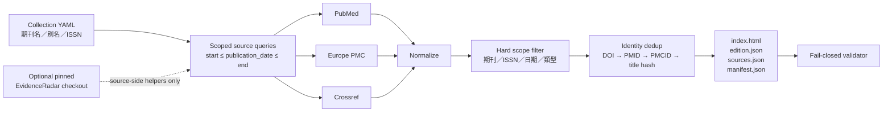

# EvidenceRadar Editions

> **狀態：v0.1.0 可交付 reference implementation。**
>
> `EvidenceRadar-Editions` 針對「指定期刊 × 指定出版日期範圍」直接查詢 PubMed、Europe PMC 與 Crossref，建立可稽核、可重建、可離線閱讀的期刊 edition。它可以受控參考同一作者的 [`EvidenceRadar`](https://github.com/hoiyu915-droid/EvidenceRadar) source-side helpers，但**不讀取 EvidenceRadar 的 `artifacts/`、`runs/`、`state/` 或 Pages 產出物**。

## 這個 repository 解決什麼

EvidenceRadar 是廣域、近期、事件窗導向的研究雷達；Editions 是定點、期間導向的出版工具。兩者可以共用來源治理與安全邊界，但產品問題不同：

| 系統 | 核心問題 | 典型範圍 |
|---|---|---|
| EvidenceRadar | 最近發生了哪些合格研究事件？ | 多來源、多領域、近期事件窗 |
| EvidenceRadar Editions | 某期刊在指定出版區間有哪些可辨識記錄？ | 單一期刊、任意歷史區間 |

Editions 的時間語義固定寫入每份輸出：

> **current-source reconstruction of historical publication window**

也就是說，2026 年重新建立 2025 年 1 月 edition，回答的是「目前的來源如何描述 2025 年 1 月」，不是「2025 年 1 月底當時 Radar 恰好看見什麼」。後補 PMID／PMCID、metadata 修正、撤回或 OA 狀態變化，都可能讓重建結果跟當年的即時觀測不同。

## 架構



不允許的資料路徑：

```text
EvidenceRadar/artifacts ─┐
EvidenceRadar/runs      ├─ X  不作為 Editions input
EvidenceRadar/state     ┤
EvidenceRadar/public    ┘
```

## 最快驗證：完全離線 fixture build

```bash
python -m pip install -e .

rm -rf outputs/jama-network-open-2026-08-fixture

evidenceradar-editions build \
  --collection config/collections/jama-network-open.yml \
  --start 2026-08-01 \
  --end 2026-08-31 \
  --fixture-dir tests/fixtures \
  --strict-sources \
  --output outputs/jama-network-open-2026-08-fixture

evidenceradar-editions validate \
  outputs/jama-network-open-2026-08-fixture
```

Fixture 僅供 deterministic CI／smoke test；輸出的 `warnings` 會明確標記不是 live source run。

## 直接查詢原始來源

```bash
python -m pip install -e .

evidenceradar-editions build \
  --collection config/collections/jama-network-open.yml \
  --start 2026-08-01 \
  --end 2026-08-31 \
  --sources pubmed,europe_pmc,crossref \
  --strict-sources \
  --output outputs/jama-network-open/2026-08
```

預設不需要 API key。來源失敗會寫入 `sources.json`：

- `SUCCESS`：完成來源操作並取得一筆以上原始記錄。
- `NO_RESULTS`：完成來源操作，結果為零。
- `FAILED`：來源請求、解析或安全邊界失敗。

不加 `--strict-sources` 時，個別來源失敗會產生 `PARTIAL` edition，而不是把失敗偷偷當成零結果。任何來源超過 `--max-records-per-source` 的明確上限也會把 edition 標成 `PARTIAL`，並在 receipt 留下 `truncated=true`。加上 `--strict-sources`，任一來源失敗即停止交付；record bound 仍以可稽核的 partial bundle 交付。

## 受控參考 EvidenceRadar source

本 repo 把相容的 upstream commit 固定在 [`config/upstream-radar.json`](config/upstream-radar.json)。Live workflow 會 checkout 該 commit，驗證 commit、license 與 allowlisted source path，再使用 upstream `tools/network_safety.py` 的 URL／response boundary。它仍然自行建立期刊查詢，不呼叫 Radar daily run，也不讀 Radar 的任何產出物。

```bash
git clone https://github.com/hoiyu915-droid/EvidenceRadar.git .upstream/EvidenceRadar
git -C .upstream/EvidenceRadar checkout \
  6da659df845e4b76072dae016120ca76ed9c27c4

evidenceradar-editions inspect-upstream \
  --radar-root .upstream/EvidenceRadar

evidenceradar-editions build \
  --collection config/collections/jama-network-open.yml \
  --start 2026-08-01 \
  --end 2026-08-31 \
  --radar-root .upstream/EvidenceRadar \
  --output outputs/jama-network-open/2026-08
```

Upstream commit 不符時預設 fail closed。`--allow-radar-drift` 只適合刻意做 compatibility test；產出的 provenance 會標記 drift，不應拿來冒充 pinned build。

## Collection profile

建立新期刊最少只需一份 YAML：

```yaml
schema_version: "1"
id: journal-slug
name: Exact Journal Title
aliases:
  - Indexed Journal Abbreviation
issns:
  - 1234-5678
publisher: Publisher name
default_sources:
  - pubmed
  - europe_pmc
  - crossref
include_types: []
exclude_types:
  - editorial
language: en
```

匹配順序是 ISSN 優先、期刊名稱／別名次之；來源回傳後仍會做本地 hard filter。這可以擋掉 Crossref query 擴張、錯誤 container title 或來源日期條件不精確造成的旁支記錄。

Schema 位於 [`config/schemas/collection.schema.json`](config/schemas/collection.schema.json)。範本位於 [`config/collections/example-journal.yml`](config/collections/example-journal.yml)。

## 每份 edition 的四個 artifact

| Artifact | 用途 |
|---|---|
| `index.html` | 自包含、可在手機直接開啟的搜尋／篩選頁面 |
| `edition.json` | canonical 去重後文章、範圍、語義、警告與 provenance |
| `sources.json` | 每個來源的 query、endpoint、狀態、原始記錄數、請求數與錯誤 |
| `manifest.json` | edition ID、設定雜湊、upstream pin、檔案 byte size 與 SHA-256 |

`validate` 會核對 JSON 結構、article count、canonical ID 唯一性、HTML marker parity、來源狀態、`artifacts_consumed=false`，以及 manifest 綁定的 byte size／SHA-256。手動改 HTML 或 JSON 後不更新整份 bundle，validator 會拒絕。

## Identity 與去重

目前 identity key 優先序：

1. DOI
2. PMID
3. PMCID
4. `normalized title + journal + publication date` 的短 SHA-256

跨來源記錄只要共享任一 identity key，就會做 transitive union，合併作者、ISSN、PMCID、來源、URL、類型與較完整摘要。這不是 citation graph，也不宣稱能解決所有 version-of-record／preprint family；相關擴充列在 [`ROADMAP.md`](ROADMAP.md)。

## Metadata、OA 與科學結論的界線

- 搜尋命中或 bibliographic metadata 不等於已讀全文。
- `oa_status: YES` 表示來源 metadata 或 PMCID 支持 OA 判定；`fulltext_status` 預設仍是 `NOT_CHECKED`，除非未來版本留下實際全文 probe receipt。
- 摘要文字不會自動轉成科學 claim。
- Edition 不是 systematic review，也不保證涵蓋期刊網站尚未進入索引的所有內容。
- 報告不是個人醫療建議。

## GitHub Actions

- [`ci.yml`](.github/workflows/ci.yml)：Python 3.11／3.12 測試、ruff、離線 fixture build、四件套 validation、package build。
- [`build-edition.yml`](.github/workflows/build-edition.yml)：手動輸入 collection、起訖日與 sources；checkout pinned EvidenceRadar source，執行 live query，驗證後上傳 edition artifact。它不會自行 commit 或 publish。

## 開源聲明

本 repo 延續 EvidenceRadar 的雙授權邊界：

- **Apache-2.0**：source code、schema、validator、tests、workflow、executable configuration 與 agent skill。
- **CC BY 4.0**：原創文件、原創報告文字與版面、原創 selection／arrangement。

文章題名、作者、期刊名、DOI／PMID／PMCID、publisher metadata、摘要節錄與來源頁面不由本 repo 重新授權；它們仍受原來源條款約束。不得把 OA 誤當成可整篇再出版的授權。完整邊界見 [`NOTICE.md`](NOTICE.md)、[`LICENSE-CONTENT.md`](LICENSE-CONTENT.md) 與 [`OPEN_SOURCE.md`](OPEN_SOURCE.md)。

## 文件索引

- [`docs/EDITION_CONTRACT.md`](docs/EDITION_CONTRACT.md)：資料與交付契約
- [`docs/SOURCE_ADAPTERS.md`](docs/SOURCE_ADAPTERS.md)：來源查詢、解析與限制
- [`docs/UPSTREAM_INTEGRATION.md`](docs/UPSTREAM_INTEGRATION.md)：Radar source bridge 與升級流程
- [`docs/DELIVERY_CHECKLIST.md`](docs/DELIVERY_CHECKLIST.md)：release／handoff gate
- [`CONTRIBUTING.md`](CONTRIBUTING.md)：開發與 PR 規則
- [`SECURITY.md`](SECURITY.md)：安全回報與資料邊界
